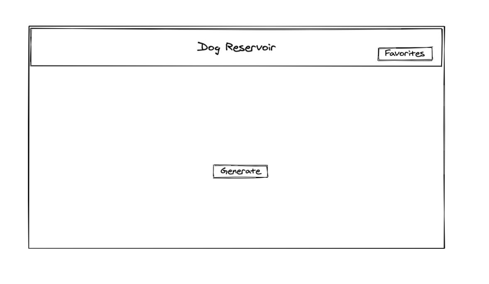
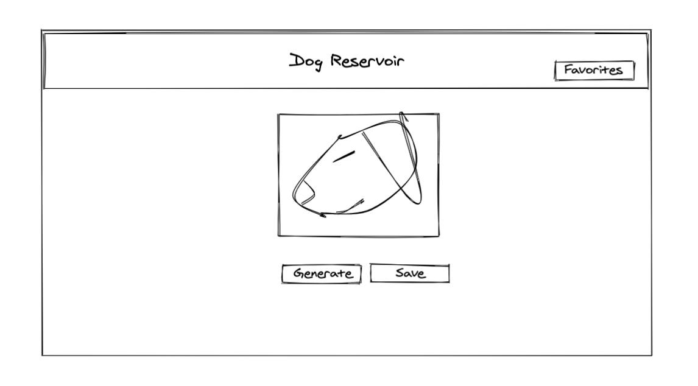
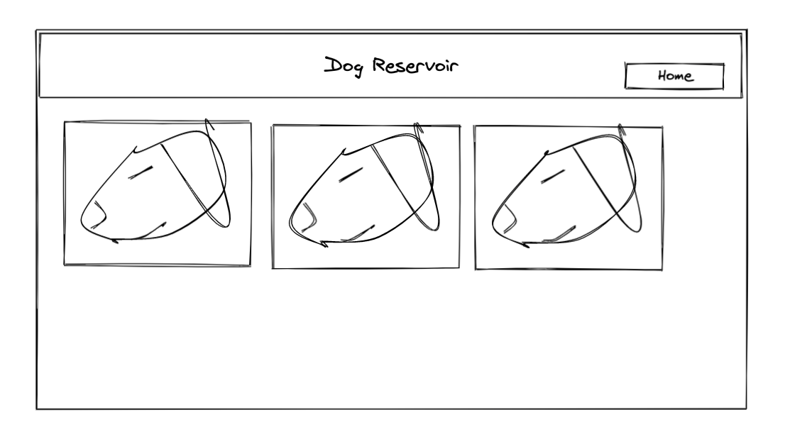
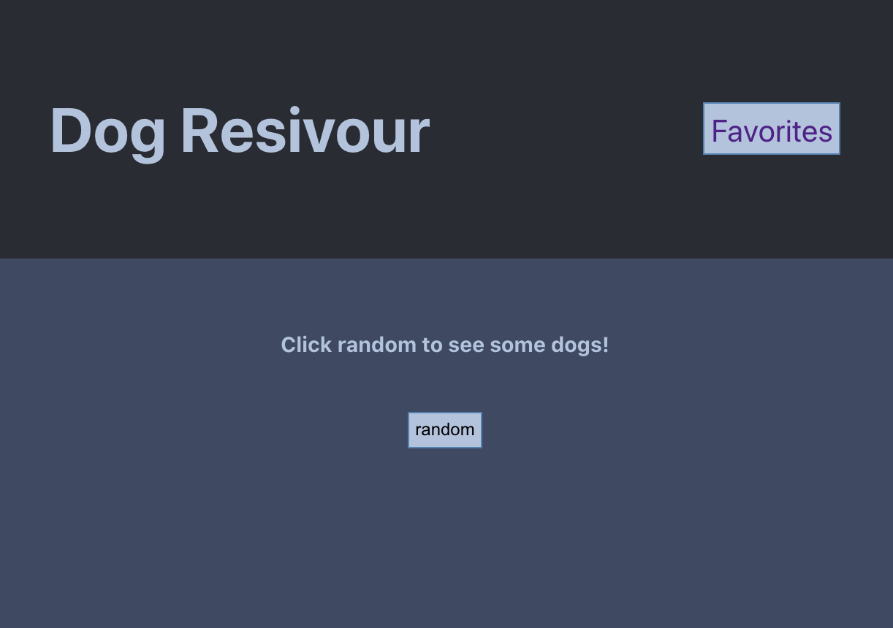
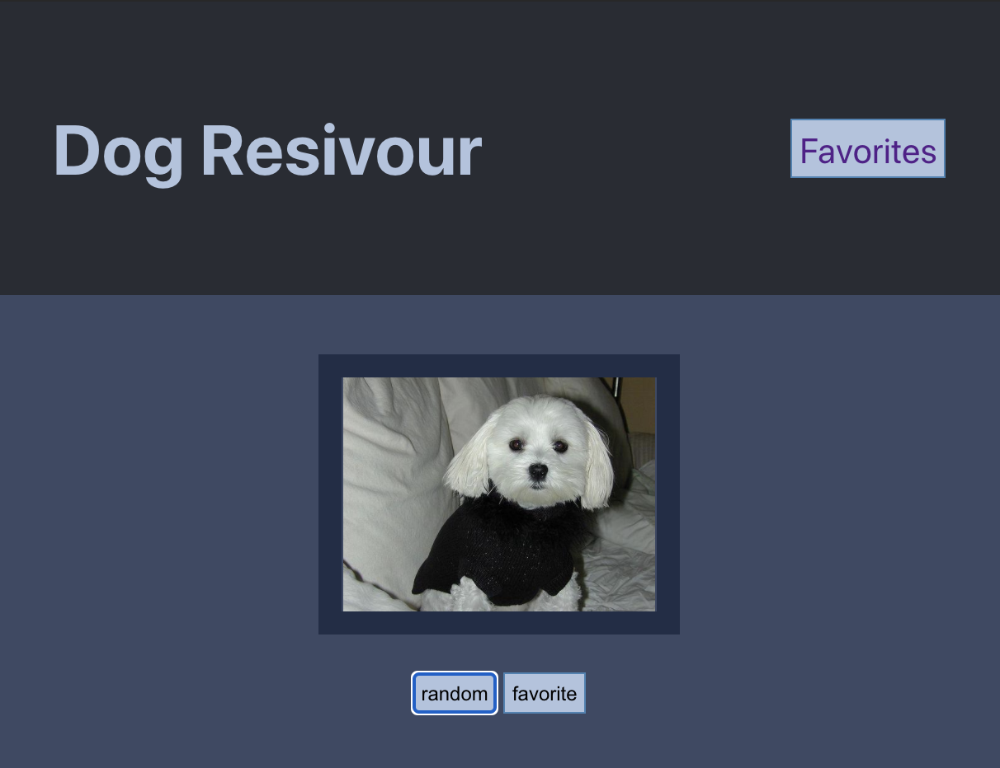
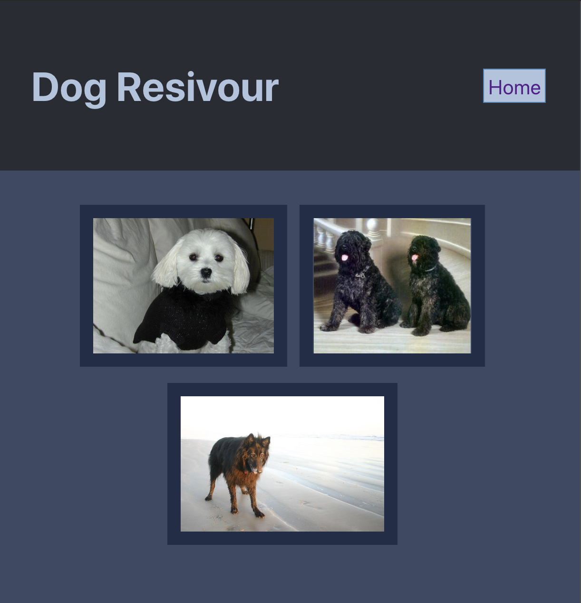

[![Contributors][contributors-shield]](https://github.com/holladayian/dogrsreservoir/graphs/contributors)
[![Forks][forks-shield]](https://github.com/holladayian/dogrsreservoir/network/members)
[![Issues][issues-shield]](https://github.com/holladayian/dogrsreservoir/issues)
[![Stars][stars-shield]](https://github.com/holladayian/dogrsreservoir)

## DogsReservoir


<br><br>

### Author

---

Ian Holladay [@holladayian](https://github.com/holladayian)


<br><br>

### Project Goal 
---

This was a final solo school project. We had 5 days to build out a react app that:
* Utilizes router to switch between links
* Fetches data from an api (abd use it asynchronously)
* Test our appplication for unit & integration 

<br><br>

### What it does
---

This is a very simple app. It allows a user to shuffle through random pictures of dogs, and save them if desired to be viewed later.

<br><br>

###  Audience
---

People who want to look at pictures of dogs on the internet.

<br><br>

###  Rough Draft
---
Landing page


Random dog


Favorites Page



<br><br>

### Final Product
---

Landing page


Random dog


Favorites Page



<br><br>

### Set Up
---

* Clone down [the dogsreservoir repo](https://github.com/holladayian/dogrsreservoir)
* CD into it.
* `$npm install` the necessary dependencies.
* Take a look.
* Feel free to `$npm test` some things out.

<br><br>

## Technologies
---
```
React
Router
Asynchronous JavaScript
Jest
travisCI
```
<br><br>
<br><br>
<br><br>
<br><br>
<br><br>
<br><br>


[contributors-shield]: https://img.shields.io/github/contributors/holladayian/dogrsreservoir.svg?style=flat-square
[contributors-url]: https://github.com/holladayian/dogrsreservoir/graphs/contributors
[forks-shield]: https://img.shields.io/github/forks/holladayian/dogrsreservoir.svg?style=flat-square
[forks-url]: https://github.com/holladayian/dogrsreservoir/network/members
[stars-shield]: https://img.shields.io/github/stars/holladayian/dogrsreservoir.svg?style=flat-square 
[stars-url]: https://github.com/holladayian/dogrsreservoir/stargazers
[issues-shield]: https://img.shields.io/github/issues/holladayian/dogrsreservoir.svg?style=flat-square
[issues-url]: https://github.com/holladayian/dogrsreservoir/issues
[product-screenshot]: images/screenshot.png
